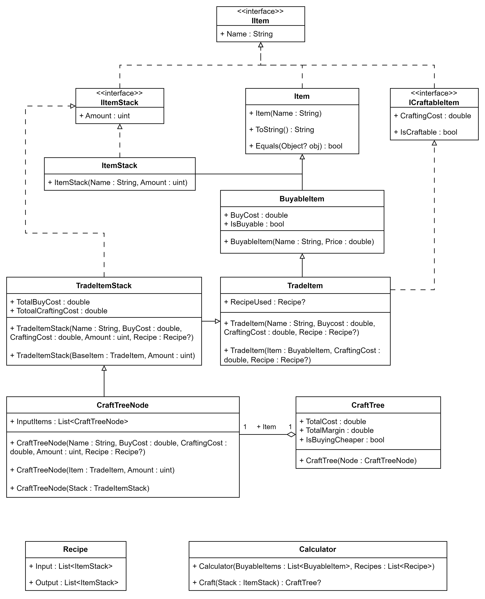

# P90's MMO CraftProfitCalc

A lightweight library for calculating the best and cheapest path for crafting an item.

## Features
- Selects the best recipe for the cheapest crafting path
- Option to buy an item if crafting is more expensive
- Profit margins
- Uses caching of calculated items for better performance

## Usage
Build a wrapper around the CraftProfitCalc and provide it with recipes and items which can be bought. The implementation is as easy as that:

```c#
ItemStack ItemsToCraft = new ItemStack("NameOfItem", 15);
List<BuyableItem> BuyableItems = new List<BuyableItem>();
List<Recipe> Recipes = new List<Recipe>();

//Todo: fill lists with items

Calculator calc = new Calculator(BuyableItems, Recipes);
CraftTree Tree = calc.Craft(ItemsToCraft);

//Todo: visualize tree
```

## Diagrams
Here is a class diagram containing all public function and properties for better visualization:


## Contribution & Support
Feel free to contact me on Discord: @P90Ez